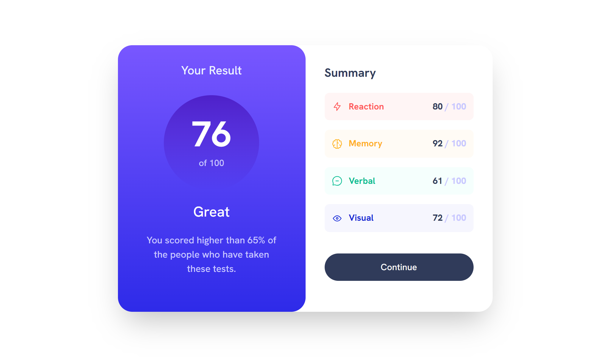
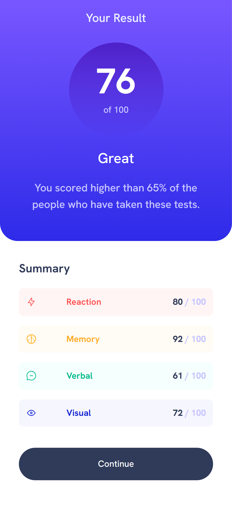

# Frontend Mentor - Results summary component solution

This is a solution to the [Results summary component challenge on Frontend Mentor](https://www.frontendmentor.io/challenges/results-summary-component-CE_K6s0maV). Frontend Mentor challenges help you improve your coding skills by building realistic projects. 

## Table of contents

- [Overview](#overview)
  - [The challenge](#the-challenge)
  - [Screenshot](#screenshot)
  - [Links](#links)
- [My process](#my-process)
  - [Built with](#built-with)
  - [What I learned](#what-i-learned)
- [Author](#author)

**Note: Delete this note and update the table of contents based on what sections you keep.**

## Overview

### The challenge

Users should be able to:

- View the optimal layout for the interface depending on their device's screen size
- See hover and focus states for all interactive elements on the page
- **Bonus**: Use the local JSON data to dynamically populate the content

### Screenshot

### Links

- Solution URL: [My solution on Frontend Mentor](https://your-solution-url.com)
- Live Site URL: [See my solution running](https://your-live-site-url.com)

## My process

### Built with

- Flexbox
- CSS Grid
- Mobile-first workflow
- [React](https://reactjs.org/) - JS library
- [Next.js](https://nextjs.org/) - React framework
- [Tailwind CSS](https://tailwindcss.com/) - For styles

### What I learned

By creating a simple project using React with Next.js and styling it with Tailwind CSS, I learned a series of fundamental concepts in modern web development. Even though the project is a single-page one and contains only a single component, the lessons learned hold significant value in enabling me to expand my knowledge in the field.

## Author

- Frontend Mentor - [@nascimentolds](https://www.frontendmentor.io/profile/nascimentolds)
